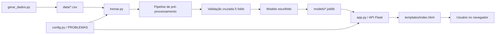
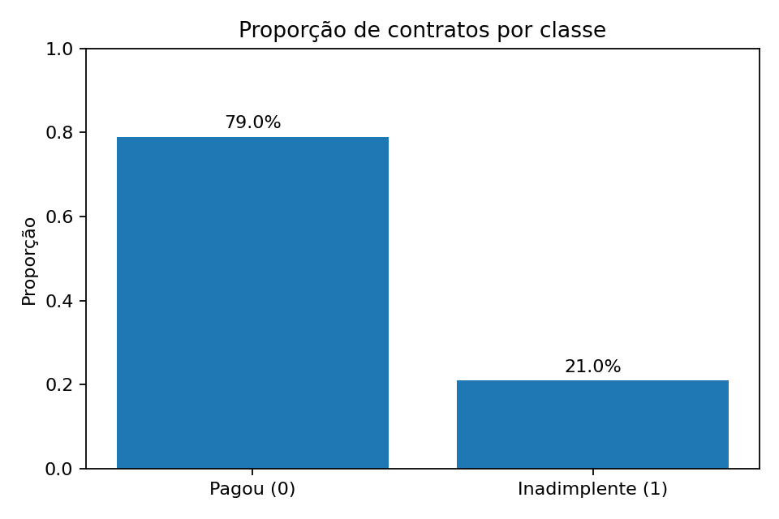
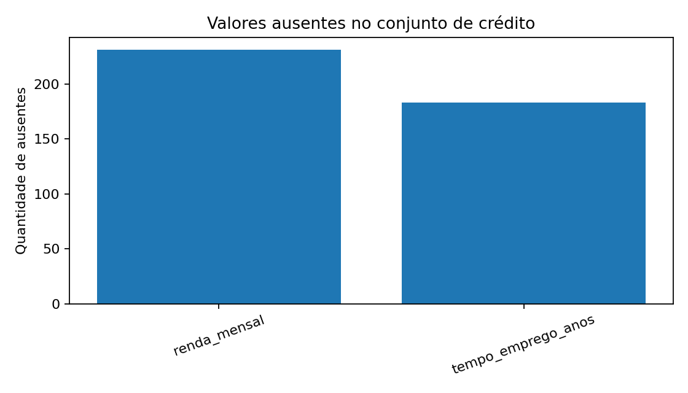
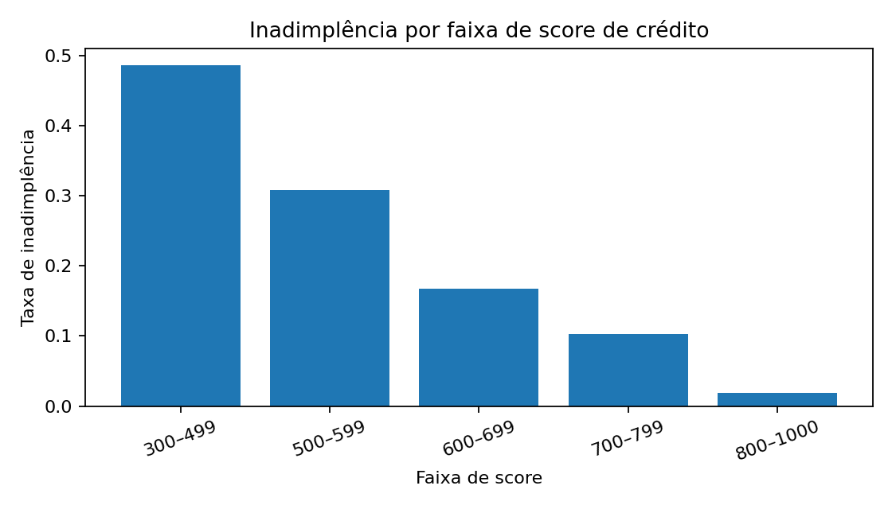
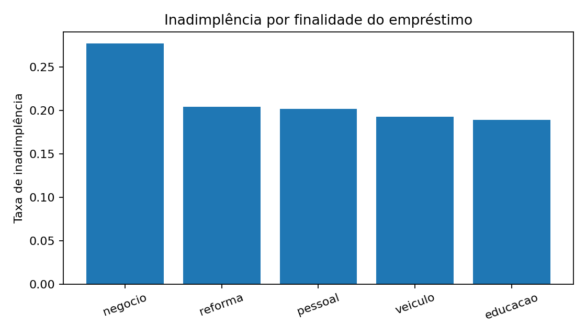
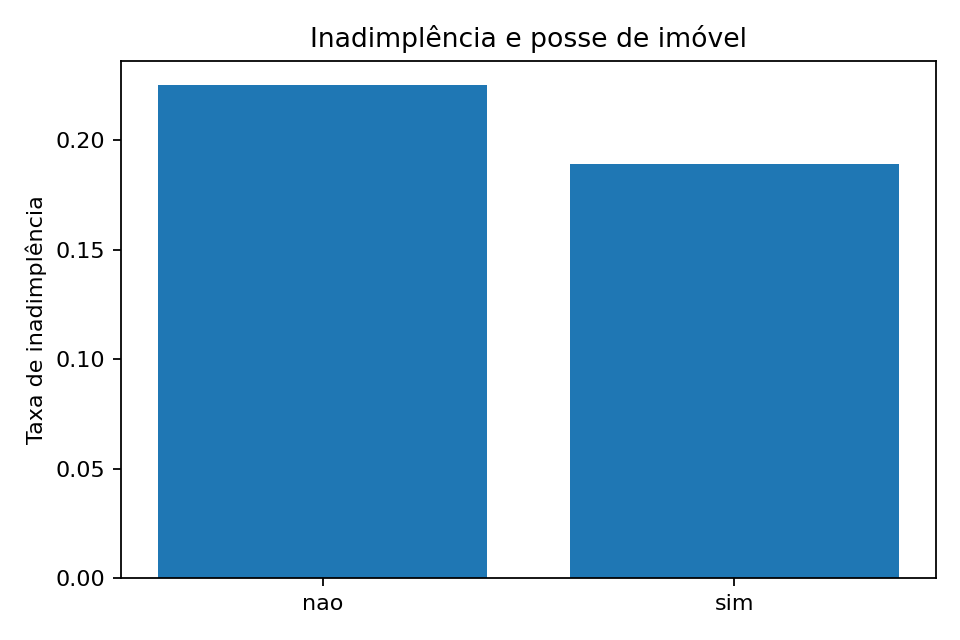
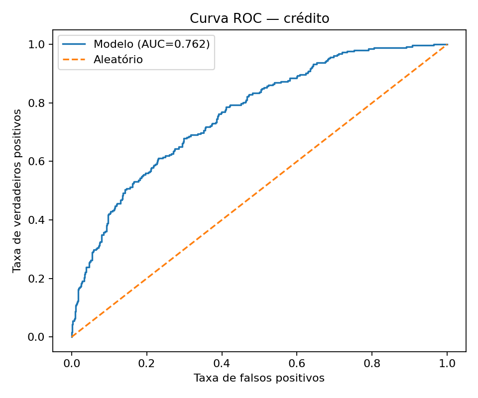
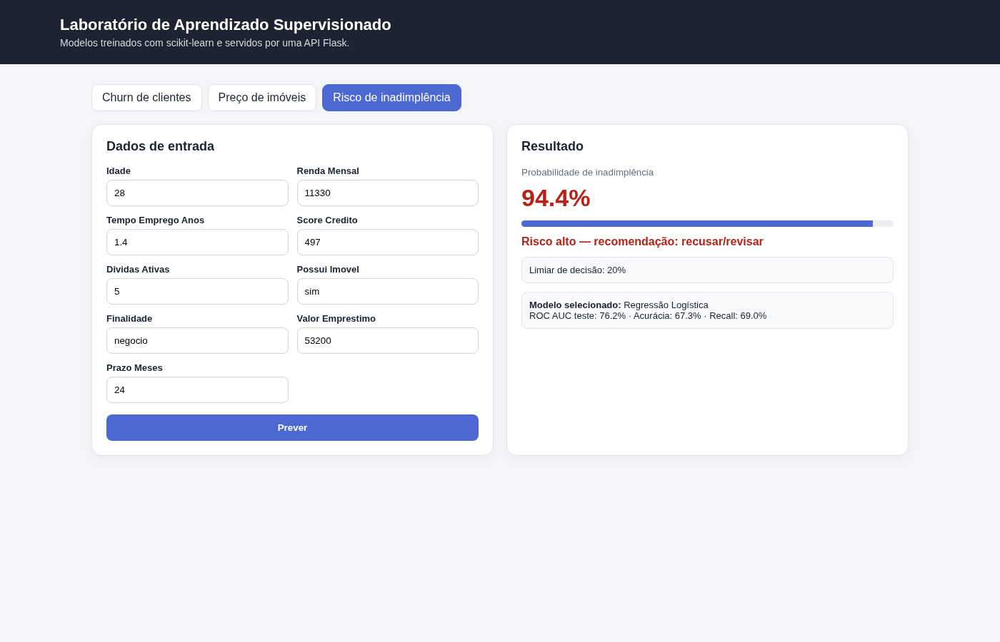
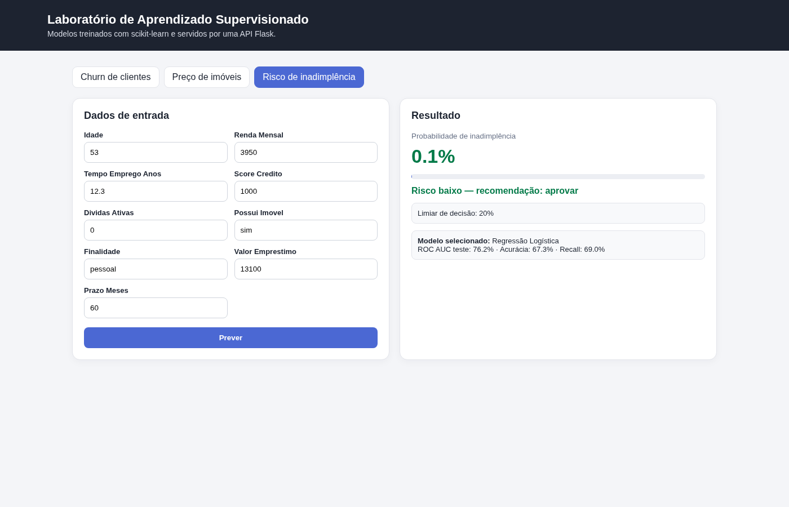

# Projeto de Machine Learning — Previsão de Inadimplência

## Alunos


- HELLEN CRISTHINE SOUZA ATANASIO RA1821616 - ENGENHARIA DA COMPUTAÇÃO

---

## 1. Visão geral

Este projeto implementa um sistema de **aprendizado de máquina supervisionado** para estimar a **probabilidade de inadimplência** de pedidos de empréstimo em uma fintech.

O trabalho segue a arquitetura usada em aula: configuração central dos problemas, geração/leitura de dados, pré-processamento com `Pipeline`, comparação de algoritmos por validação cruzada, avaliação final, persistência com `joblib`, API Flask e interface web.

O conjunto principal contém **6.000 contratos** e foi gerado por `gerar_dados.py` com `random_state=42`. A variável-alvo é:

- `inadimplente = 1`: cliente não pagou;
- `inadimplente = 0`: cliente pagou.

A base gerada neste projeto apresenta **21,03% de inadimplentes**.

---

## 2. Estrutura do projeto

```text
projeto_inadimplencia/
├── app.py                         # API Flask + aplicação web
├── config.py                      # PROBLEMAS, features, limites e opções
├── gerar_dados.py                 # gera churn.csv, imoveis.csv e credito.csv
├── ml_utils.py                    # pipelines, métricas e funções de apoio
├── treinar.py                     # CV, seleção, limiar e modelos salvos
├── analise_credito.py             # Partes 1–4 + bônus + gráficos
├── validar_projeto.py             # valida requisitos essenciais
├── requirements.txt
├── .gitignore
├── README.md
├── data/
│   ├── churn.csv
│   ├── imoveis.csv
│   └── credito.csv
├── models/
│   ├── churn.joblib
│   ├── imoveis.joblib
│   ├── credito.joblib
│   ├── churn_metadata.json
│   ├── imoveis_metadata.json
│   ├── credito_metadata.json
│   └── metricas.json
├── reports/
│   ├── analise_credito.json
│   ├── comparacao_modelos_credito.csv
│   └── analise_limiares_credito.csv
├── docs/
│   ├── graficos/
│   │   ├── 01_proporcao_inadimplencia.png
│   │   ├── 02_inadimplencia_score.png
│   │   ├── 03_inadimplencia_finalidade.png
│   │   ├── 04_inadimplencia_imovel.png
│   │   ├── 05_valores_ausentes.png
│   │   └── 06_curva_roc.png
│   └── capturas/
│       ├── risco_alto.png
│       └── risco_baixo.png
└── templates/
    └── index.html
```

### Arquitetura



---

## 3. Como executar

### 3.1 Criar ambiente virtual

Windows PowerShell:

```powershell
python -m venv .venv
.venv\Scripts\Activate.ps1
```

Linux/macOS:

```bash
python -m venv .venv
source .venv/bin/activate
```

### 3.2 Instalar dependências

```bash
pip install -r requirements.txt
```

### 3.3 Gerar os dados

```bash
python gerar_dados.py
```

Saída esperada inclui:

```text
data/churn.csv: 5000 linhas
data/imoveis.csv: 4000 linhas
data/credito.csv: 6000 linhas
Inadimplentes: 21.0%
```

### 3.4 Treinar os modelos

```bash
python treinar.py
```

O treinamento:

1. divide treino e teste em 80/20;
2. usa estratificação nos problemas de classificação;
3. fixa `random_state=42`;
4. coloca imputação, padronização e one-hot encoding dentro do `Pipeline`;
5. compara algoritmos com validação cruzada de 5 folds;
6. escolhe o modelo sem olhar o conjunto de teste;
7. no crédito, escolhe também o limiar usando apenas previsões out-of-fold do treino;
8. salva o modelo final em `models/`.

### 3.5 Executar a análise completa do crédito

```bash
python analise_credito.py
```

Esse comando gera os gráficos e relatórios em `docs/graficos/` e `reports/`.

### 3.6 Rodar a aplicação

```bash
python app.py
```

Acesse:

```text
http://localhost:5000
```

### 3.7 Validar a entrega

```bash
python validar_projeto.py
```

---

# 4. Parte 1 — Análise exploratória

## 4.1 Proporção de inadimplentes

A base possui **6.000 contratos**.

- Pagaram: **78,97%**
- Inadimplentes: **21,03%**



## 4.2 Valores ausentes

Foram encontrados valores ausentes em:

| Coluna | Ausentes |
|---|---:|
| `renda_mensal` | 231 |
| `tempo_emprego_anos` | 183 |

Os ausentes são tratados **dentro do Pipeline**, usando mediana para features numéricas. Isso evita vazamento de dados porque os valores usados na imputação são aprendidos somente no treino de cada fold.



## 4.3 Inadimplência e score de crédito

| Faixa de score | Taxa de inadimplência |
|---|---:|
| 300–499 | 48,60% |
| 500–599 | 30,83% |
| 600–699 | 16,79% |
| 700–799 | 10,33% |
| 800–1000 | 1,84% |

O comportamento é coerente com a finalidade da variável: **quanto maior o score, menor a inadimplência observada**.



## 4.4 Inadimplência e finalidade

| Finalidade | Taxa de inadimplência |
|---|---:|
| negócio | 27,68% |
| reforma | 20,44% |
| pessoal | 20,18% |
| veículo | 19,24% |
| educação | 18,93% |

Na base sintética, empréstimos para **negócio** apresentam a maior taxa de inadimplência.



## 4.5 Inadimplência e posse de imóvel

| Possui imóvel | Taxa de inadimplência |
|---|---:|
| não | 22,50% |
| sim | 18,90% |

Clientes com imóvel apresentaram menor taxa de inadimplência neste conjunto.



## 4.6 Coluna descartada

A coluna `id_contrato` foi descartada da modelagem.

**Justificativa:** é um identificador único e não representa uma característica econômica do cliente ou do empréstimo. Usá-lo poderia estimular memorização sem capacidade de generalização para contratos novos.

---

# 5. Parte 2 — Modelagem

## 5.1 Divisão treino/teste

Foi utilizada exatamente a separação solicitada:

```python
train_test_split(
    X,
    y,
    test_size=0.20,
    random_state=42,
    stratify=y,
)
```

O teste fica isolado durante a seleção de algoritmo e durante a escolha do limiar.

## 5.2 Pipeline de pré-processamento

Features numéricas:

- `SimpleImputer(strategy="median")`;
- `StandardScaler()`.

Features categóricas:

- `SimpleImputer(strategy="most_frequent")`;
- `OneHotEncoder(handle_unknown="ignore")`.

Todo o pré-processamento está dentro de um `ColumnTransformer` e de um `Pipeline`, evitando vazamento entre treino e validação.

## 5.3 Comparação de algoritmos — 5 folds / ROC AUC

| Algoritmo | ROC AUC médio | Desvio |
|---|---:|---:|
| **Regressão Logística** | **0,7781** | 0,0224 |
| Random Forest | 0,7611 | 0,0233 |
| Gradient Boosting | 0,7547 | 0,0217 |
| Árvore de Decisão | 0,7126 | 0,0216 |

O melhor desempenho médio foi obtido pela **Regressão Logística**, que foi selecionada para a avaliação final.

Os números também estão em `reports/comparacao_modelos_credito.csv`.

---

# 6. Parte 3 — Avaliação no conjunto de teste

O modelo final foi ajustado somente depois da escolha por validação cruzada.

Para a decisão de negócio foi usado o limiar **0,20**, escolhido apenas com o conjunto de treino conforme descrito na Parte 4.

## 6.1 Métricas

| Métrica | Resultado |
|---|---:|
| Acurácia | 67,33% |
| Precisão | 35,66% |
| Recall | 69,05% |
| F1 | 47,03% |
| ROC AUC | **0,7625** |

## 6.2 Matriz de confusão

Considerando a classe positiva `1 = inadimplente`:

|  | Previsto pagador | Previsto inadimplente |
|---|---:|---:|
| **Real pagador** | TN = 634 | FP = 314 |
| **Real inadimplente** | FN = 78 | TP = 174 |

## 6.3 Interpretação de FP e FN no negócio

**Falso positivo (FP):** o cliente pagaria corretamente, mas o modelo o classifica como inadimplente. No sistema, esse cliente pode ter o crédito recusado. O custo definido pelo exercício é a perda de **R$ 1.500** de lucro potencial.

**Falso negativo (FN):** o cliente realmente ficará inadimplente, mas o modelo o classifica como bom pagador. O empréstimo é aprovado e gera uma perda de **R$ 8.000**.

Portanto, **o falso negativo é mais caro** neste negócio: um único FN custa mais de cinco vezes um FP. Isso justifica priorizar recall e utilizar um limiar inferior a 0,50.

## 6.4 Curva ROC



---

# 7. Parte 4 — Limiar de decisão e custo

A escolha do limiar **não utiliza o conjunto de teste**.

As probabilidades foram obtidas no treino por:

```python
cross_val_predict(
    pipeline,
    X_treino,
    y_treino,
    cv=5,
    method="predict_proba",
)
```

Custos utilizados:

```text
FN: inadimplente aprovado = R$ 8.000
FP: bom cliente recusado = R$ 1.500
```

## 7.1 Comparação de limiares no treino — previsões out-of-fold

| Limiar | Precisão | Recall | FP | FN | Custo total |
|---:|---:|---:|---:|---:|---:|
| 0,15 | 33,33% | 82,18% | 1660 | 180 | R$ 3.930.000 |
| **0,20** | **38,76%** | **74,26%** | **1185** | **260** | **R$ 3.857.500** |
| 0,25 | 42,82% | 63,76% | 860 | 366 | R$ 4.218.000 |
| 0,30 | 47,23% | 54,95% | 620 | 455 | R$ 4.570.000 |
| 0,35 | 50,49% | 45,94% | 455 | 546 | R$ 5.050.500 |
| 0,40 | 53,42% | 37,92% | 334 | 627 | R$ 5.517.000 |
| 0,50 | 60,90% | 24,06% | 156 | 767 | R$ 6.370.000 |
| 0,60 | 68,97% | 13,86% | 63 | 870 | R$ 7.054.500 |

### Recomendação

O limiar recomendado é **0,20**, pois apresentou o menor custo total entre os limiares analisados nas previsões out-of-fold do treino.

Aplicado **uma única vez no teste**, esse limiar produziu:

- FP: 314;
- FN: 78;
- custo no teste: **R$ 1.095.000**.

O conjunto de teste foi usado somente para estimar o desempenho final da decisão já escolhida.

---

# 8. Parte 5 — Integração ao sistema

O problema `credito` foi adicionado ao dicionário `PROBLEMAS` de `config.py` com todas as features, limites e opções.

Features disponíveis na interface:

- idade;
- renda mensal;
- tempo de emprego;
- score de crédito;
- dívidas ativas;
- posse de imóvel;
- finalidade;
- valor do empréstimo;
- prazo em meses.

A aplicação possui três abas:

1. Churn de clientes;
2. Preço de imóveis;
3. **Risco de inadimplência**.

A API expõe:

```text
GET  /api/problemas
POST /api/prever/credito
```

No problema de crédito, a decisão usa o limiar recomendado de 20% salvo nos metadados do treinamento.

## 8.1 Exemplo de risco alto

Exemplo usado:

```text
idade = 28
renda_mensal = 11.330
score_credito = 497
dividas_ativas = 5
finalidade = negocio
valor_emprestimo = 53.200
prazo_meses = 24
```

Probabilidade estimada: **94,4%**.



## 8.2 Exemplo de risco baixo

Exemplo usado:

```text
idade = 53
renda_mensal = 3.950
tempo_emprego_anos = 12,3
score_credito = 1000
dividas_ativas = 0
possui_imovel = sim
finalidade = pessoal
valor_emprestimo = 13.100
prazo_meses = 60
```

Probabilidade estimada: **0,1%**.



---

# 9. Parte 6 — Reflexão ética e LGPD

Modelos de crédito podem reproduzir desigualdades e discriminações presentes nos dados históricos. Mesmo que aumentassem o desempenho, não utilizaríamos atributos sensíveis como raça/cor, religião, orientação sexual, opinião política, saúde, origem étnica ou proxies evidentes dessas características para decidir concessão de crédito. No contexto da LGPD, o tratamento deve observar finalidade, necessidade, transparência e segurança, evitando coleta excessiva e oferecendo governança sobre decisões automatizadas que afetem o titular. Por isso, além das métricas, o modelo deve ser monitorado por grupos relevantes, ter decisões auditáveis, permitir revisão humana e utilizar somente dados necessários e justificáveis para a análise de risco.

---

# 10. Desafios extras — bônus

## 10.1 Feature: comprometimento de renda

Foi criada a feature:

```python
comprometimento_renda = (
    valor_emprestimo * 1.33 / prazo_meses / renda_mensal
)
```

Resultados com Regressão Logística em validação cruzada:

| Experimento | ROC AUC médio |
|---|---:|
| Features originais | 0,77807 |
| + comprometimento de renda | 0,77792 |

Diferença: **-0,00015**.

Neste conjunto, a feature derivada **não melhorou** o ROC AUC. Isso pode ocorrer porque valor, prazo e renda já estão presentes e a regressão logística consegue capturar boa parte da informação disponível.

## 10.2 GridSearchCV

Foi realizado `GridSearchCV` em Random Forest.

Melhor configuração encontrada:

```text
n_estimators = 200
max_depth = 6
min_samples_leaf = 3
```

Melhor ROC AUC de validação: **0,76358**.

Mesmo ajustado, o Random Forest permaneceu abaixo da Regressão Logística neste conjunto.

## 10.3 `class_weight="balanced"`

Comparação por previsões out-of-fold do treino, usando limiar 0,50:

| Regressão Logística | Precisão | Recall |
|---|---:|---:|
| normal | 60,90% | 24,06% |
| `class_weight="balanced"` | 39,09% | 71,09% |

O balanceamento aumentou bastante o **recall**, mas reduziu a **precisão**. Isso é compatível com um modelo que passa a marcar mais contratos como risco para reduzir falsos negativos.

---

# 11. Decisões de projeto e prevenção de vazamento

- `id_contrato` nunca entra nas features;
- o conjunto de teste é separado antes da comparação dos algoritmos;
- imputadores e `StandardScaler` são ajustados dentro do Pipeline;
- o `OneHotEncoder` é ajustado somente nos dados disponíveis em cada fold;
- o melhor algoritmo é escolhido pela validação cruzada do treino;
- o limiar é escolhido por `cross_val_predict` somente no treino;
- o teste é consultado apenas no final;
- `random_state=42` garante reprodutibilidade;
- um ROC AUC exageradamente alto é tratado como possível sinal de vazamento.

---

# 12. Arquivos de resultados

Os resultados numéricos podem ser consultados sem executar novamente:

- `reports/analise_credito.json` — resumo completo;
- `reports/comparacao_modelos_credito.csv` — tabela de validação cruzada;
- `reports/analise_limiares_credito.csv` — precisão, recall e custo por limiar;
- `models/credito_metadata.json` — modelo selecionado, teste, limiar e versões;
- `models/metricas.json` — métricas dos três problemas do sistema.

---

# 13. Tecnologias

- Python
- pandas
- NumPy
- scikit-learn
- matplotlib
- joblib
- Flask
- HTML, CSS e JavaScript

---

# 14. Sugestão de commits

Uma sequência organizada para subir o trabalho ao GitHub:

```bash
git add .gitignore requirements.txt config.py
git commit -m "chore: configure machine learning project"

git add gerar_dados.py data/
git commit -m "feat: add synthetic datasets including credit data"

git add ml_utils.py treinar.py models/
git commit -m "feat: implement supervised learning pipelines and training"

git add analise_credito.py reports/ docs/graficos/
git commit -m "feat: add credit analysis threshold optimization and bonus experiments"

git add app.py templates/ docs/capturas/
git commit -m "feat: integrate credit risk model into Flask interface"

git add validar_projeto.py README.md
git commit -m "docs: add complete project documentation"
```

Depois:

```bash
git push -u origin main
```

---

## Observação final

Este projeto tem finalidade **acadêmica e didática**. Os dados são sintéticos e o modelo não deve ser utilizado para concessão real de crédito sem validação regulatória, monitoramento de viés, governança, segurança e revisão por especialistas.
